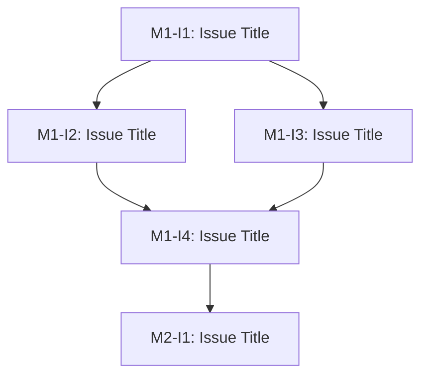

# Project Planning Document

<!-- This document is created and maintained by the Orchestration Agent -->
<!-- It decomposes approved requirements into executable milestones and issues -->
<!-- Referenced documents: requirements.md -->

**Project:** [Project Name]  
**Version:** [X.X]  
**Status:** [Draft | Active | Complete]  
**Last Updated:** [YYYY-MM-DD]  
**Based on Requirements:** requirements.md v[X.X]  
**Orchestration Agent:** Orchestration Agent

---

## Document Control

| Field | Value |
|-------|-------|
| Document Status | [Draft \| Active \| Complete] |
| Current Version | [X.X] |
| Last Modified | [YYYY-MM-DD] |
| Requirements Version | [X.X] |
| Planning Approved By | [Product Owner Name or "Pending"] |
| Approval Date | [YYYY-MM-DD or "Pending"] |

---

## Milestone Overview

<!-- High-level summary of all project milestones -->
<!-- Each milestone should represent 2-4 weeks of work -->

| Milestone ID | Name | Objective | Start Date | Target End | Status | Dependencies | Completion % |
|--------------|------|-----------|------------|------------|--------|--------------|--------------|
| M1 | [Milestone Name] | [What this achieves] | [YYYY-MM-DD] | [YYYY-MM-DD] | [Planned \| In Progress \| Testing \| Complete \| Blocked] | [None or M-ID] | [0-100]% |
| M2 | [Milestone Name] | [What this achieves] | [YYYY-MM-DD] | [YYYY-MM-DD] | [Planned \| In Progress \| Testing \| Complete \| Blocked] | [None or M-ID] | [0-100]% |

---

## Issue Breakdown

<!-- Detailed breakdown of issues within each milestone -->
<!-- Each issue must map to source requirements and have clear acceptance criteria -->

### Milestone M1: [Milestone Name]

**Objective:** [What this milestone achieves]  
**Duration:** [Start Date] to [Target End Date]  
**Status:** [Planned | In Progress | Testing | Complete | Blocked]  
**Dependencies:** [None | Milestone IDs]

**Completion Criteria:**
- [ ] [Criterion 1]
- [ ] [Criterion 2]

#### Issue M1-I1: [Issue Title]

**Description:** [Detailed description of what needs to be done]  
**Assigned Agent:** [Documentation Agent | Orchestration Agent | UI/UX Agent | Coding Agent | Testing Agent | Reporting Agent]  
**Capabilities Required:** [List specific capabilities needed]  
**Effort Estimate:** [X hours/days]  
**Priority:** [High | Medium | Low]  
**Status:** [Open | In Progress | Testing | Blocked | Resolved]  
**Dependencies:** [None | Issue IDs]

**Source Requirements:**
- FR-XXX: [Requirement title]
- NFR-XXX: [Requirement title]

**Acceptance Criteria:**
- [ ] [Specific, testable criterion 1]
- [ ] [Specific, testable criterion 2]

**Notes:** [Any special considerations, risks, or implementation guidance]

**Status History:**
| Date | Status | Agent | Notes |
|------|--------|-------|-------|
| [YYYY-MM-DD] | [Status] | [Agent] | [Change reason] |

#### Issue M1-I2: [Issue Title]

**Description:** [Detailed description of what needs to be done]  
**Assigned Agent:** [Agent Name]  
**Capabilities Required:** [List specific capabilities needed]  
**Effort Estimate:** [X hours/days]  
**Priority:** [High | Medium | Low]  
**Status:** [Open | In Progress | Testing | Blocked | Resolved]  
**Dependencies:** [None | Issue IDs]

**Source Requirements:**
- FR-XXX: [Requirement title]

**Acceptance Criteria:**
- [ ] [Specific, testable criterion 1]
- [ ] [Specific, testable criterion 2]

**Notes:** [Any special considerations]

**Status History:**
| Date | Status | Agent | Notes |
|------|--------|-------|-------|
| [YYYY-MM-DD] | [Status] | [Agent] | [Change reason] |

<!-- Add more issues for this milestone as needed -->

### Milestone M2: [Milestone Name]

**Objective:** [What this milestone achieves]  
**Duration:** [Start Date] to [Target End Date]  
**Status:** [Planned | In Progress | Testing | Complete | Blocked]  
**Dependencies:** [None | Milestone IDs]

**Completion Criteria:**
- [ ] [Criterion 1]
- [ ] [Criterion 2]

<!-- Add issues for additional milestones following the same pattern -->

---

## Execution Order

<!-- Define the phased execution sequence with dependencies -->

### Phase 1: [Phase Name]

**Duration:** [Start] to [End]  
**Objective:** [What this phase achieves]

**Issues in Sequence:**
1. M1-I1: [Issue Title] → Prerequisites: [None]
2. M1-I2: [Issue Title] → Prerequisites: [M1-I1]
3. M1-I3: [Issue Title] → Prerequisites: [M1-I1, M1-I2]

**Dependencies:**
- [External dependency 1]
- [External dependency 2]

**Blocking Risks:**
- [Risk that could block this phase]

### Phase 2: [Phase Name]

**Duration:** [Start] to [End]  
**Objective:** [What this phase achieves]

**Issues in Sequence:**
1. M2-I1: [Issue Title] → Prerequisites: [M1-I3]
2. M2-I2: [Issue Title] → Prerequisites: [M2-I1]

**Dependencies:**
- [External dependency]

**Blocking Risks:**
- [Risk that could block this phase]

---

## Dependency Summary

<!-- Visual and textual representation of dependencies -->

### Critical Path

1. [Issue ID] → [Issue ID] → [Issue ID] → [Milestone Complete]

### Dependency Graph

### External Dependencies

| Dependency | Owner | Required By | Status | Risk Level |
|------------|-------|-------------|--------|------------|
| [External System/API] | [Team/Vendor] | [Issue ID] | [Available \| Pending \| Blocked] | [High \| Medium \| Low] |

---

## Rework & Failure Routing Rules

<!-- Define what happens when issues fail or need rework -->

| Condition | Action | Routing | Escalation |
|-----------|--------|---------|------------|
| Test fails on first attempt | Rework by original agent | Return to assigned agent | None |
| Test fails on second attempt | Investigation required | Return to assigned agent + Testing Agent review | Escalate to Product Owner |
| Requirements conflict discovered | Clarification needed | Escalate to Documentation Agent | Block until resolved |
| Dependency blocked | Wait or find workaround | Issue status → Blocked | Escalate if blocked >48 hours |
| Agent capacity exceeded | Reassign or defer | Orchestration Agent reassigns | Escalate if affects critical path |

---

## Stop / Pause Conditions

<!-- Define conditions that halt or pause execution -->

### Mandatory Stop Conditions

- ❌ **Critical security vulnerability discovered** → Stop all work, escalate immediately
- ❌ **Requirements not approved** → Cannot proceed to planning
- ❌ **Planning not approved** → Cannot proceed to execution
- ❌ **Critical test failures** → Cannot proceed to next milestone
- ❌ **Governance violation detected** → Stop, investigate, escalate

### Pause Conditions

- ⚠️ **External dependency unavailable** → Pause dependent issues
- ⚠️ **Product Owner unavailable for approval** → Pause milestone completion
- ⚠️ **Lab environment down** → Pause testing activities
- ⚠️ **High-priority change request** → Pause current work for assessment

---

## Risk Register

| Risk ID | Description | Probability | Impact | Mitigation Strategy | Owner | Status |
|---------|-------------|-------------|--------|---------------------|-------|--------|
| R-001 | [Risk description] | [High \| Medium \| Low] | [High \| Medium \| Low] | [How to mitigate or avoid] | [Agent/Person] | [Active \| Mitigated \| Realized] |
| R-002 | [Risk description] | [High \| Medium \| Low] | [High \| Medium \| Low] | [How to mitigate or avoid] | [Agent/Person] | [Active \| Mitigated \| Realized] |

---

## Resource Allocation

<!-- Track agent assignments and capacity -->

| Agent | Active Issues | Pending Issues | Capacity Status | Notes |
|-------|---------------|----------------|-----------------|-------|
| Documentation Agent | [Issue IDs] | [Issue IDs] | [Available \| At Capacity \| Overloaded] | [Notes] |
| Orchestration Agent | [Issue IDs] | [Issue IDs] | [Available \| At Capacity \| Overloaded] | [Notes] |
| UI/UX Agent | [Issue IDs] | [Issue IDs] | [Available \| At Capacity \| Overloaded] | [Notes] |
| Coding Agent | [Issue IDs] | [Issue IDs] | [Available \| At Capacity \| Overloaded] | [Notes] |
| Testing Agent | [Issue IDs] | [Issue IDs] | [Available \| At Capacity \| Overloaded] | [Notes] |
| Reporting Agent | [Issue IDs] | [Issue IDs] | [Available \| At Capacity \| Overloaded] | [Notes] |

---

## Timeline & Schedule

<!-- Gantt-style timeline representation -->

### Week-by-Week Breakdown

| Week | Dates | Milestone | Issues Planned | Notes |
|------|-------|-----------|----------------|-------|
| W1 | [Mon] to [Fri] | M1 | [Issue IDs] | [Notes] |
| W2 | [Mon] to [Fri] | M1 | [Issue IDs] | [Notes] |
| W3 | [Mon] to [Fri] | M2 | [Issue IDs] | [Notes] |

---

## Approval Record

**Status:** [Draft | Active | Complete]  
**Planning Submitted for Approval:** [YYYY-MM-DD]  
**Reviewed By:** [Product Owner Name]  
**Planning Approved:** [YYYY-MM-DD]  
**Comments:** [Any approval comments or conditions]

---

## Revision History

| Version | Date | Author | Changes | Status |
|---------|------|--------|---------|--------|
| 1.0 | [YYYY-MM-DD] | Orchestration Agent | Initial planning | [Draft \| Active \| Complete] |
| 1.1 | [YYYY-MM-DD] | Orchestration Agent | [Description of changes] | [Draft \| Active \| Complete] |
