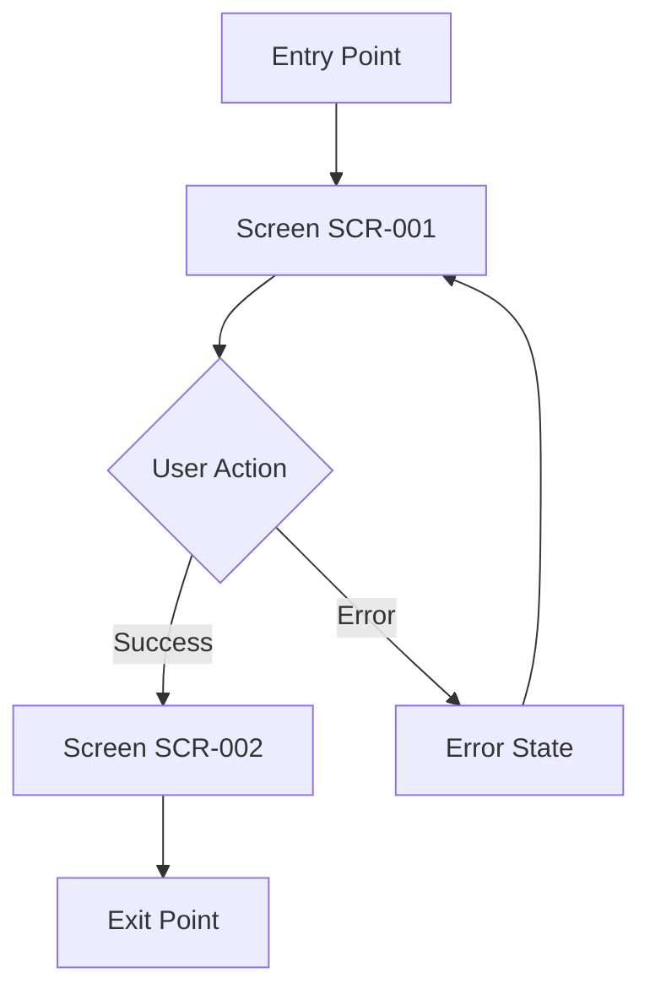

# UI/UX Intent Documentation

<!-- This document is created and maintained by the UI/UX Agent -->
<!-- It describes user experience intent without prescribing exact implementation -->
<!-- Referenced documents: requirements.md, project-plan.md -->

**Project:** [Project Name]  
**Version:** [X.X]  
**Status:** [Draft | Under Review | Approved]  
**Last Updated:** [YYYY-MM-DD]  
**Based on Requirements:** requirements.md v[X.X]  
**Issue Reference:** [Issue ID from project-plan.md]  
**UI/UX Agent:** UI/UX Agent

---

## Document Control

| Field | Value |
|-------|-------|
| Document Status | [Draft \| Under Review \| Approved] |
| Current Version | [X.X] |
| Last Modified | [YYYY-MM-DD] |
| Approved By | [Product Owner or Coding Agent Name or "Pending"] |
| Approval Date | [YYYY-MM-DD or "Pending"] |

---

## UX Goals

<!-- Define what users should accomplish and how they should feel -->

### User Goals

<!-- What must users be able to accomplish? -->

1. [User goal 1 - e.g., "User can complete registration in under 2 minutes"]
2. [User goal 2 - e.g., "User can recover from errors without losing data"]

### Emotional Outcomes

<!-- How should users feel during and after interaction? -->

- [Emotional outcome 1 - e.g., "User feels confident and in control"]
- [Emotional outcome 2 - e.g., "User feels the system is trustworthy"]

### User Personas

<!-- Who are the primary users? -->

| Persona | Characteristics | Primary Needs | Design Implications |
|---------|----------------|---------------|---------------------|
| [Persona Name] | [Age, tech proficiency, context] | [What they need] | [How design should accommodate] |

---

## Screen / Flow Inventory

<!-- List all screens and flows in this issue scope -->

| Screen ID | Screen Name | Purpose | User Flow | Priority |
|-----------|-------------|---------|-----------|----------|
| SCR-001 | [Screen Name] | [What users do here] | [From → This → To] | [High \| Medium \| Low] |
| SCR-002 | [Screen Name] | [What users do here] | [From → This → To] | [High \| Medium \| Low] |

---

## Interaction Intent

<!-- Describe interaction intent for each screen without prescribing exact layouts -->

### Screen SCR-001: [Screen Name]

**Purpose:** [What this screen enables users to do]  
**Entry Point:** [How users arrive at this screen]  
**Exit Points:** [Where users go from here]

**User Journey:**
1. [Step 1 - what user does]
2. [Step 2 - what system responds with]
3. [Step 3 - what happens next]

**Interactive Elements:**

| Element ID | Element Type | Label/Placeholder | Interaction | Validation Rules | Error Handling |
|------------|--------------|-------------------|-------------|------------------|----------------|
| EL-001 | [Text input \| Button \| Dropdown \| etc.] | [Text shown to user] | [What happens when user interacts] | [Rules - e.g., "Required, max 50 chars"] | [Error message shown] |
| EL-002 | [Element Type] | [Label/Placeholder] | [Interaction] | [Validation] | [Error message] |

**State Behaviors:**

| State | Trigger | Visual Feedback | System Response |
|-------|---------|-----------------|-----------------|
| [Loading] | [User clicks submit] | [Show spinner on button] | [Disable form, call API] |
| [Success] | [API returns 200] | [Show success message] | [Navigate to next screen] |
| [Error] | [API returns error] | [Show error message] | [Keep form data, enable retry] |

**Accessibility Requirements:**
- [Requirement 1 - e.g., "All form fields must have labels"]
- [Requirement 2 - e.g., "Error messages must be announced to screen readers"]
- [WCAG 2.1 Level AA compliance required]

**Responsive Behavior:**
- **Mobile (<768px):** [How layout adapts]
- **Tablet (768-1024px):** [How layout adapts]
- **Desktop (>1024px):** [How layout adapts]

### Screen SCR-002: [Screen Name]

**Purpose:** [What this screen enables users to do]  
**Entry Point:** [How users arrive]  
**Exit Points:** [Where users go]

**User Journey:**
1. [Step 1]
2. [Step 2]
3. [Step 3]

**Interactive Elements:**

| Element ID | Element Type | Label/Placeholder | Interaction | Validation Rules | Error Handling |
|------------|--------------|-------------------|-------------|------------------|----------------|
| EL-003 | [Element Type] | [Label] | [Interaction] | [Validation] | [Error message] |

**State Behaviors:**

| State | Trigger | Visual Feedback | System Response |
|-------|---------|-----------------|-----------------|
| [State] | [Trigger] | [Feedback] | [Response] |

**Accessibility Requirements:**
- [Requirement]

**Responsive Behavior:**
- **Mobile (<768px):** [Adaptation]
- **Tablet (768-1024px):** [Adaptation]
- **Desktop (>1024px):** [Adaptation]

---

## Non-Implied Behavior

<!-- Explicitly state what is NOT specified to prevent assumptions -->

**Visual Design Not Specified:**
- [Element 1 - e.g., "Exact colors, fonts, and spacing not specified - defer to design system"]
- [Element 2 - e.g., "Icon choices not specified - coding agent may choose appropriate icons"]

**Interaction Details Not Specified:**
- [Interaction 1 - e.g., "Exact animation timing not specified"]
- [Interaction 2 - e.g., "Loading indicator style not specified"]

**Technical Implementation Not Specified:**
- [Technical detail 1 - e.g., "Choice of UI framework left to coding agent"]
- [Technical detail 2 - e.g., "State management approach not specified"]

---

## Constraints & Non-Goals

<!-- Limitations and explicit exclusions -->

### Design Constraints

- [Constraint 1 - e.g., "Must use existing component library"]
- [Constraint 2 - e.g., "Must work with keyboard navigation only"]

### Non-Goals for This Issue

- [Non-goal 1 - e.g., "Custom theming interface not included in this issue"]
- [Non-goal 2 - e.g., "Advanced filtering not included in this issue"]

---

## Mapping to Acceptance Criteria

<!-- Map each acceptance criterion from requirements/project-plan to design decisions -->

| Acceptance Criterion | Source | Design Element | How It's Met |
|---------------------|---------|----------------|--------------|
| [Criterion text] | [FR-XXX or M1-I1-AC1] | [Screen/Element ID] | [Explanation of how design meets this] |
| [Criterion text] | [FR-XXX or M1-I1-AC2] | [Screen/Element ID] | [Explanation] |

---

## Edge Cases & Error Scenarios

<!-- Document how design handles errors and edge cases -->

| Scenario | User Action | System State | Design Response |
|----------|-------------|--------------|-----------------|
| [Network failure during submit] | [User submits form] | [API call fails] | [Show error message, preserve data, offer retry] |
| [Invalid input] | [User enters bad data] | [Validation fails] | [Highlight field, show specific error, keep other data] |
| [Empty state] | [User opens screen] | [No data available] | [Show empty state message, offer action] |

---

## User Flow Diagram

<!-- Optional: Visual representation of user flow -->

---

## Approval Record

**Status:** [Draft | Under Review | Approved | Rejected]  
**Submitted for Review:** [YYYY-MM-DD]  
**Reviewed By:** [Coding Agent or Product Owner]  
**Approval Date:** [YYYY-MM-DD]  
**Comments:** [Any review comments]

---

## Supporting Assets

<!-- Inventory of wireframes, mockups, or other design artifacts -->

| Asset File | Type | Screen/Flow | Description | Last Updated |
|------------|------|-------------|-------------|--------------|
| [filename.png] | [Wireframe \| Mockup \| Prototype \| etc.] | [SCR-XXX] | [What this shows] | [YYYY-MM-DD] |

**Assets Location:** `/docs/ui-assets/[issue-id]/`

---

## Revision History

| Version | Date | Author | Changes | Approval Status |
|---------|------|--------|---------|-----------------|
| 1.0 | [YYYY-MM-DD] | UI/UX Agent | Initial version | [Status] |
| 1.1 | [YYYY-MM-DD] | UI/UX Agent | [Changes based on review feedback] | [Status] |
